# Chapter 5 and Chapter 6. Empirical analysis of vertical price transmission in Ukraine's dairy market

## Chapter 5. Data and empirical design

This chapter explains how the empirical system is constructed after correcting the governmental price logic and after tightening the downstream retail definition. The purpose is not only to describe the datasets, but also to show why some data combinations are valid for the main chain and why others can be used only as supporting evidence. This order follows the logic of the thesis as a whole: the question is not simply whether prices co-move, but where in the Ukrainian dairy chain shocks are translated, filtered, delayed, or strategically managed.

### 5.1 Final data sources description

The empirical chain is defined at the territorial level of Ukraine for the core governmental stages. Farm-gate, producer, and consumer prices are national averages in the corrected official series, so the main chain must preserve the same territorial meaning. By contrast, ProZorro is retained as an all-Ukraine transactional layer because procurement prices are observed through realized tenders and contracts rather than through national averaging. Retail is modeled through Silpo, Novus, and a combined retail category series built from harmonized product-level observations.

The final inventory contains 19 source or derivative blocks. The harmonized retail item universe contains 82,296 retailer-date observations. The standardized product dictionary compresses raw product definitions into 9 common domestic categories: Drinking milk / fermented milk, Butter, CHEESE, Sour cream, Cream, Yogurt / dessert, Condensed milk, Milk powder, Other. CHEESE is intentionally treated as one domestic category across producer, consumer, ProZorro, Silpo, and Novus so that the main tables compare like with like rather than several partially overlapping cheese subgroups under different names. Other is kept as an explicit residual dairy category instead of being dropped silently.

The product-definition audit flags 275 ambiguous or approximate mappings. This matters because the model does not assume that products are comparable merely because names look similar. Governmental datasets define products directly through official row labels, farm-gate through the agricultural product label, ProZorro through procurement profiles and tender titles, and retail through product names, item titles, normalized brands, fat-content cues, and package descriptions. The audit therefore belongs to the identification strategy itself.

Farm-gate remains the raw-milk benchmark. This is economically necessary because farm-gate captures the origin of milk-supply pressure, but it is not a literal processed-product price. For that reason, the thesis treats farm-gate as the upstream raw-milk anchor and compares it both to product-level series and to chain-level dairy indices rather than forcing it into a false one-to-one equivalence with processed goods.

Figure 5.1 opens the empirical chapter with the corrected governmental layers. Figure 5.2 then shows the observed retail series at product level. Here the retail price object is the observed package price based on `price_current`, not a unit-price transformation. This is an important correction because the consumer-facing shelf price is the relevant downstream object for transmission and discount analysis.

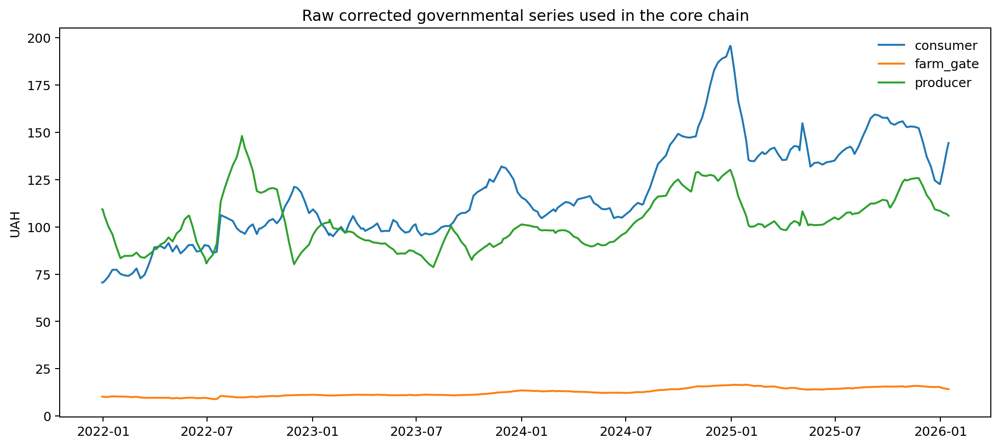

Source: author's calculations based on the corrected FarmGateUA, ProducerUA, and ConsumerUA layers from `full_uah_final.xlsx`.

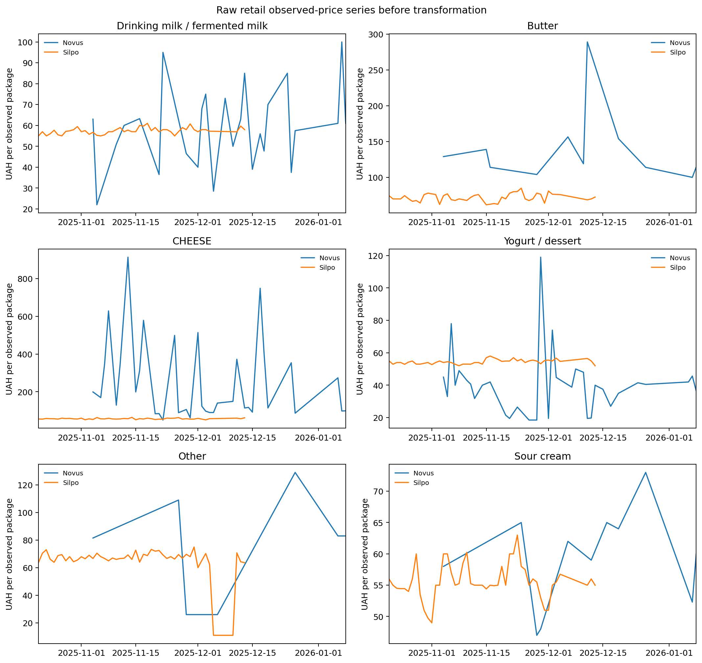

Source: author's calculations based on harmonized Silpo and Novus item data. The figure focuses on the main categories and the most frequent additional retail categories in the sample: Drinking milk / fermented milk, Butter, CHEESE, Yogurt / dessert, Other, Sour cream.

### 5.2 Reconstruction logic, external benchmarks, and transformation choices

The corrected monthly official series remain the base truth. Their widening to daily frequency is inherited from the corrected source workbook, but the thesis does not treat daily interpolation as if it were direct market observation. Instead, the design is explicitly two-layered. Weekly medians provide the opening long-run layer for equilibrium-style modelling. Daily data provide the main layer for short-run timing, procurement discreteness, and discount-driven retail behaviour. This separation is a modelling choice with economic meaning, not a presentation trick.

{{FORMULA|p_week(w) = median{ p_d : d belongs to week w }}}

Weekly medians are used because they suppress local procurement jumps and transient retail noise without erasing the broader price path. This is particularly important for ProZorro, where tender timing and contract revisions can create sharp day-specific moves that are institutional rather than market-clearing in character. Retail smoothing is lighter, because promotions and markdowns are part of the mechanism under study and should not be over-smoothed away.

The same distinction also disciplines interpretation. A weekly coefficient is read as evidence about the baseline transmission path after high-frequency noise is compressed. A daily coefficient is read as evidence about timing, tactical adjustment, or temporary buffering. This difference matters for a consumer-market thesis: households observe shelf prices daily, but strategic pass-through is easier to identify once the high-frequency price environment has first been stabilized.

European dairy prices and CME Class III are retained as external benchmarks rather than as domestic structural stages. Their function is to anchor the corrected Ukrainian series within a broader dairy cycle, to make the reconstruction logic explicit, and to show that the corrected domestic paths remain economically coherent after the former aggregation error is removed. The strongest producer-to-Europe co-movement appears in Butter (0.781, 1056 aligned observations); Drinking milk / fermented milk (0.732, 1056 aligned observations); Milk powder (0.431, 1056 aligned observations).

The correlation between the raw-milk benchmark and CME Class III equals 0.413 over the overlapping sample.

{{FORMULA|ln(P_t^agg) = SUM_i w_i * ln(P_it),     SUM_i w_i = 1}}

The aggregate dairy index uses a fixed-weight geometric rule with weights based on procurement participation, retail assortment support, and an equal-weight anchor. The largest final weights belong to CHEESE (50.4%); Drinking milk / fermented milk (35.8%); Sour cream (13.8%).

Figures 5.3 to 5.5 follow the descriptive logic used in strong empirical theses: first external context, then transformed product-level domestic series, and only after that the aggregate market-level robustness layer. Each figure therefore answers a different question in sequence: where the broader dairy cycle comes from, what the corrected domestic product paths look like, and how those product paths translate into a latent chain-level dairy price index.

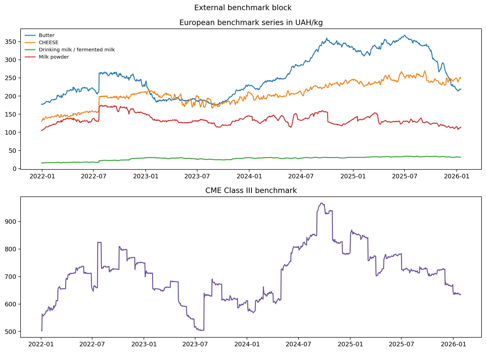

Source: author's calculations based on European benchmark series and CME Class III in UAH-equivalent terms.

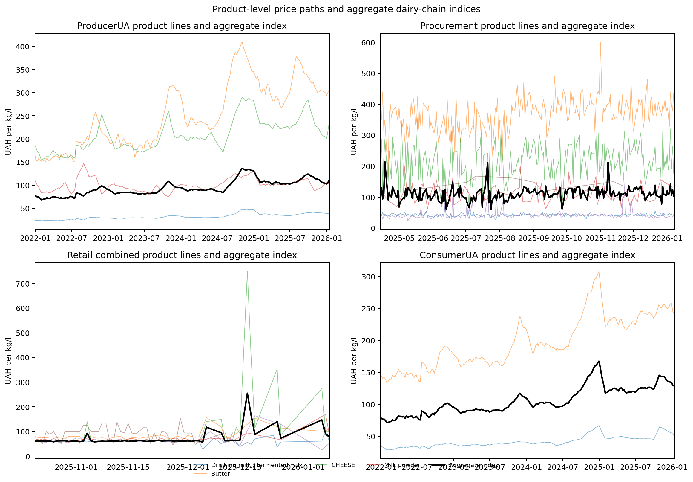

Source: author's calculations based on producer, procurement, retail combined, and ConsumerUA product-level series.

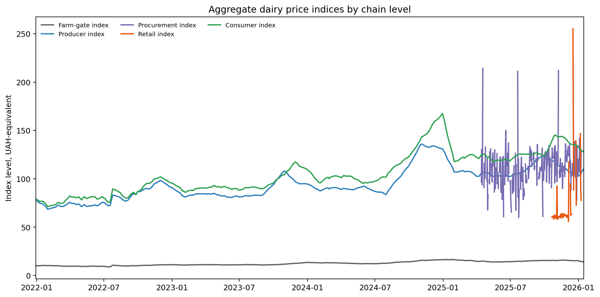

Source: author's calculations based on fixed-weight geometric dairy indices.

### 5.3 Retail harmonisation, discount logic, and downstream endpoint construction

The downstream block is reconstructed from the product level upward. Each Silpo and Novus SKU is standardized by product type, retailer, brand, and item identity. Package size, fat content, and title-level wording are used to make the mapping more precise, but the final price object remains the observed package price. The models do not rely on `unit_price` for Silpo or Novus as the main downstream price. Unit-based fields are retained only as support metadata, while the observed retail series used for modelling are based on `price_current` and on the reconstructed non-promotional baseline built from the markdown information.

{{FORMULA|p_observed = price_current     ;     p_baseline = price_current + discount_value, if discount_value > 0}}

{{FORMULA|discount_dummy = 1(discount active), 0(otherwise)     ;     markdown_rate = (p_baseline - p_observed) / p_baseline}}

After harmonisation, the audit records 204 item keys matched across both shops, 1304 Silpo-only keys, and 1000 Novus-only keys. Only 110 matched keys survive the strictest one-to-one alignment rule. This is why the final downstream category series are built from stable product-type medians rather than from a naive pooling of all available SKUs. The aim is to measure price movement, not assortment replacement.

In practical terms, the retail layer therefore contains two linked price objects. The first is the observed consumer-facing package price, which is the right object for pass-through and consumer-visibility analysis. The second is the reconstructed baseline price, which approximates the non-promotional shelf level and is more suitable for long-run comparison. This distinction makes it possible to separate price transmission from promotional masking instead of conflating both in one downstream series.

Butter in Novus: новгород сіверський (1 item keys, 3 days); Butter in Silpo: лавка традицій (23 item keys, 48 days); CHEESE in Novus: комо (39 item keys, 8 days); CHEESE in Silpo: лавка традицій (9 item keys, 48 days); Condensed milk in Novus: пмкк (5 item keys, 4 days); Condensed milk in Silpo: первомайський мкк (4 item keys, 48 days).

Yogurt / dessert -> Yogurt (705 item keys); CHEESE -> Cheese (574 item keys); Yogurt / dessert -> Dairy dessert / glazed snack (318 item keys); Drinking milk / fermented milk -> Milk (277 item keys); Butter -> Butter (148 item keys); Cream -> Cream (128 item keys).

The most active ProZorro regions in the dairy sample are Київська (1001 observations); Дніпропетровська (598 observations); Полтавська (578 observations); Житомирська (505 observations); Вінницька (503 observations).

Figures 5.6 to 5.10 summarize the downstream structure that the models actually use. The product-distribution and brand-distribution figures show where retailer data are dense enough to support category medians. The procurement-region figure clarifies where institutional price information is concentrated. The Silpo discount figure then isolates the behavioural layer that later matters in Chapter 6. Novus is not included in that discount-environment figure because it does not provide a comparable explicit markdown structure.

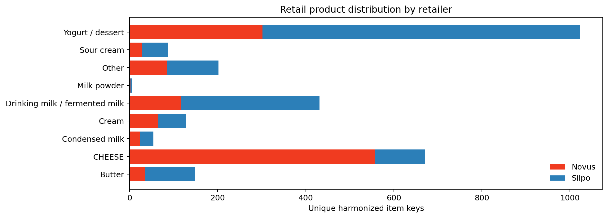

Source: author's calculations based on harmonized Silpo and Novus item keys.

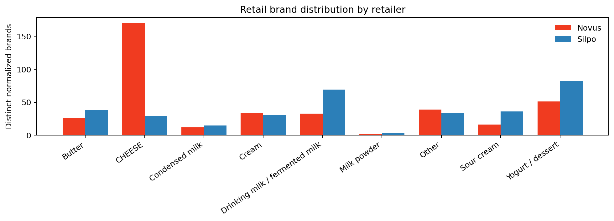

Source: author's calculations based on normalized retailer-brand support.

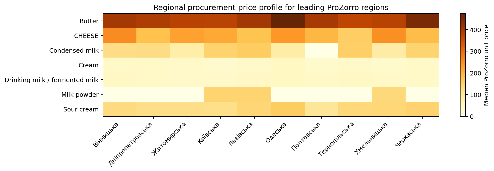

Source: author's calculations based on ProZorro unit-price observations across regions.

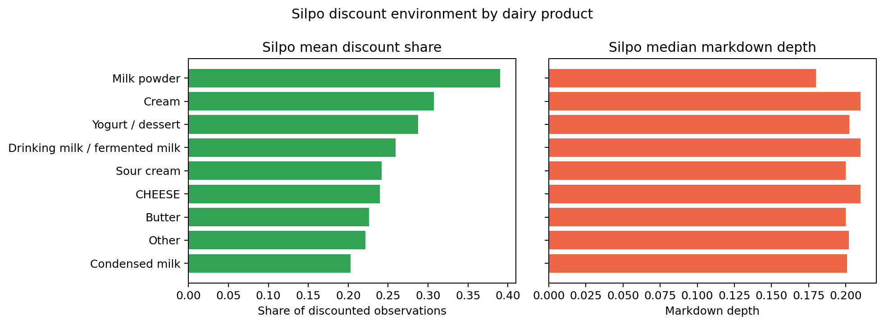

Source: author's calculations based on Silpo discount incidence and positive markdown depth only.

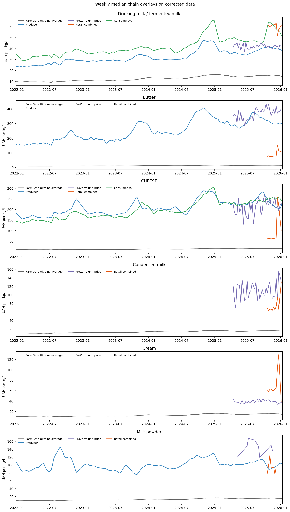

Source: author's calculations based on weekly medians for farm-gate, producer, procurement, retail combined, and ConsumerUA.

The farm-gate benchmark is then separated into a dedicated comparison block. This is important because raw milk is not a literal processed-product price, but it is the upstream pressure point that later feeds into processors, procurement, and finally the consumer market. The benchmark figures therefore help distinguish a true upstream signal from a misleading same-product comparison.

The lag profile confirms that farm-gate pressure is visible first where product mapping remains closest to raw-milk content. Sour cream in FarmGate -> Producer shows best weekly lag correlation 0.932 at lag 0; Drinking milk / fermented milk in FarmGate -> Producer shows best weekly lag correlation 0.928 at lag 0; Butter in FarmGate -> Producer shows best weekly lag correlation 0.903 at lag 0. In the retained weekly equations, Butter in FarmGate -> Producer retains ECM with coefficient 1.481 and error-correction term -0.039; CHEESE in FarmGate -> Producer retains ECM with coefficient 0.766 and error-correction term -0.064; Milk powder in FarmGate -> Producer retains ECM with coefficient 0.257 and error-correction term -0.039.

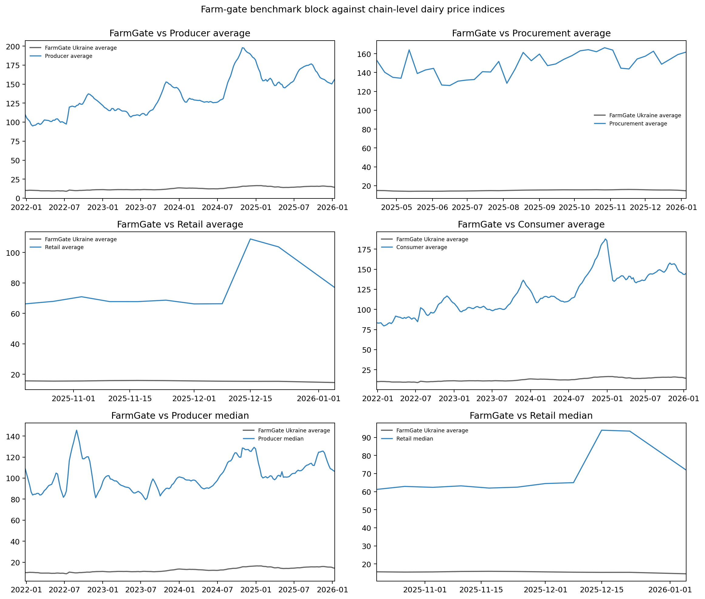

Source: author's calculations based on weekly chain-level medians and averages.

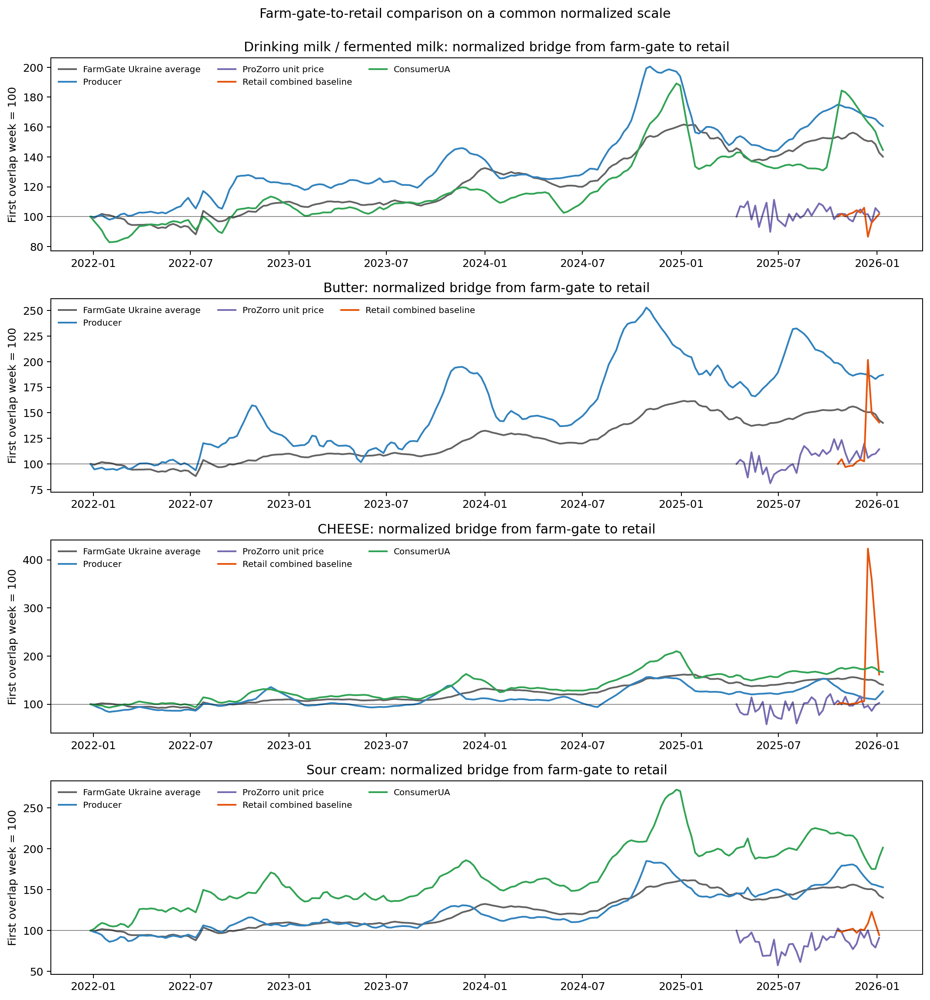

Source: author's calculations based on normalized weekly product-level paths, with the first common observation scaled to 100.

### 5.4 Admissibility rules, dataset intersections, and readiness for estimation

Before estimation, every candidate link is screened by overlap length, continuity, mapping quality, and support from non-interpolated observations. This is crucial because the corrected data are cleaner, but the valid intersection is not uniformly wide across all chain stages. The model does not treat every mechanically aligned pair as equally admissible.

The formal screening yields 1 strong intersections, 4 acceptable intersections, 10 weak-but-usable extension intersections, and 126 unusable links. The scarcity of strong intersections is itself informative. It shows that honest product matching and honest overlap rules impose discipline on the empirical system. In the corrected data, the main chain can be estimated, but not every potential link can be interpreted with the same degree of confidence.

This screen also clarifies the role of weekly versus daily data. Weekly medians are the first layer because they are the right starting point for long-run and error-correction reasoning. Daily data then become the main layer when the research turns to short-run price reaction, procurement discreteness, discount management, and retailer-specific timing. In that sense, the chapter ends where the estimation chapter begins: with a structured statement of what is estimable, what is only supportive, and why.

## Chapter 6. Estimation results and interpretation

The estimation chapter is organized in the same economic order as the chain itself. It begins upstream, where the cleanest long-run evidence should appear if vertical transmission exists. It then moves downstream, where transmission becomes more strategically filtered. Only after that does it turn to backward robustness, retail discount mechanisms, procurement-scale effects, and system-level robustness. This sequencing matters because the thesis is not trying to maximize the number of estimated coefficients. It is trying to show where shocks travel credibly and where they are absorbed or strategically managed.

### 6.1 Model strategy, diagnostics, and reliability of the retained evidence

The final design uses weekly ARDL, ECM, and NARDL specifications as the long-run opening layer, followed by daily local projections, spread models, discount models, and procurement-scale equations as the main short-run mechanism layer. VECM is treated as a system-feasibility and robustness block. This strategy reflects the corrected data architecture itself. Weekly aggregation is appropriate for equilibrium-style relations. Daily frequency is necessary once the analysis reaches procurement discreteness and retail behaviour.

On the corrected final data, ARDL remains part of the screening design, but only 0 retained ARDL rows survive the reporting threshold. ECM contributes 21 retained rows and NARDL contributes 30 retained rows. Product-level VECM attempts number 27, of which 3 are feasible. The hierarchy of evidence is therefore explicit rather than assumed: the weekly core is selective, the daily mechanism block is central for downstream interpretation, and the system block is informative mainly as robustness.

This ordering is close to the logic used in strong empirical KSE theses: first establish which equations remain admissible after diagnostics, then interpret only those parts of the empirical system that survive the filter, and finally separate the system-level robustness exercise from the main identification story. The present chapter follows that logic deliberately so that the narrative strength of the results does not exceed the empirical support behind them.

Across the retained weekly equations, 38 satisfy the Ljung-Box threshold, 36 satisfy the Breusch-Pagan threshold, 33 satisfy the White threshold, and 30 satisfy the Jarque-Bera threshold. These counts help order the evidence rather than replace model-by-model judgement.

{{TABLE|Table 6.1. Key synthesis of the retained empirical results|../outputs/chapter_tables/table_6_1_key_results_synthesis.csv|Source: author's calculations based on the strongest retained weekly, daily, discount, procurement-scale, aggregate-index, and system-robustness outputs.}}

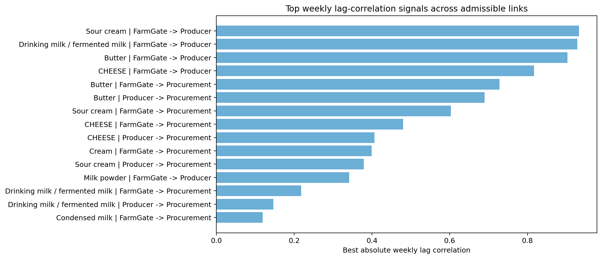

Source: author's calculations based on the weekly lag-profile scan.

### 6.2 Upstream-to-downstream transmission and the pairwise weekly models

The weekly pairwise block starts from the upstream end of the chain. This is where the most defensible long-run evidence should appear if the corrected data are working properly. That expectation is borne out by the results. The cleanest retained relations lie in the producer-to-procurement segment, not in the late downstream segment. In economic terms, this means that the processor-to-procurement transition carries the most stable equilibrium signal, while the retail-facing segment is more institutionally and strategically filtered.

The strongest retained weekly equation is Condensed milk: FarmGate -> Procurement in the weekly_raw specification, estimated with NARDL, reported coefficient -5.536, and error-correction term -1.722.

Procurement is therefore not a trivial middle layer. It is the point where processor price pressure becomes institutional transaction price pressure. That is exactly where buffering, contract timing, and lot-specific selection can change the form of transmission before it reaches the shelf. The weekly models support the thesis argument that the Ukrainian dairy chain is vertically connected, but not frictionless.

For drinking milk / fermented milk, the best retained weekly relation is NARDL in weekly_raw, with coefficient 1.036 and error-correction term -1.156. The asymmetry p-value equals 0.011. For cheese, the best retained weekly relation is NARDL in weekly_raw, with coefficient 4.078 and error-correction term -1.346. The asymmetry p-value equals 0.018. For sour cream, the best retained weekly relation is NARDL in weekly_raw, with coefficient 4.823 and error-correction term -0.769. The asymmetry p-value equals 0.010. For butter, the best retained weekly relation is NARDL in weekly_raw, with coefficient 3.579 and error-correction term -0.760. The asymmetry p-value equals 0.009.

The lag profile confirms that farm-gate pressure is visible first where product mapping remains closest to raw-milk content. Sour cream in FarmGate -> Producer shows best weekly lag correlation 0.932 at lag 0; Drinking milk / fermented milk in FarmGate -> Producer shows best weekly lag correlation 0.928 at lag 0; Butter in FarmGate -> Producer shows best weekly lag correlation 0.903 at lag 0. In the retained weekly equations, Butter in FarmGate -> Producer retains ECM with coefficient 1.481 and error-correction term -0.039; CHEESE in FarmGate -> Producer retains ECM with coefficient 0.766 and error-correction term -0.064; Milk powder in FarmGate -> Producer retains ECM with coefficient 0.257 and error-correction term -0.039.

The same logic also explains why several downstream weekly links remain weak. Once retail enters the picture, observed pass-through becomes more sensitive to assortment, promotional timing, and retailer-specific price management. The weekly results do not show that downstream transmission is absent. They show that downstream transmission should not be reduced to one common long-run coefficient when empirical support is late and behaviourally filtered.

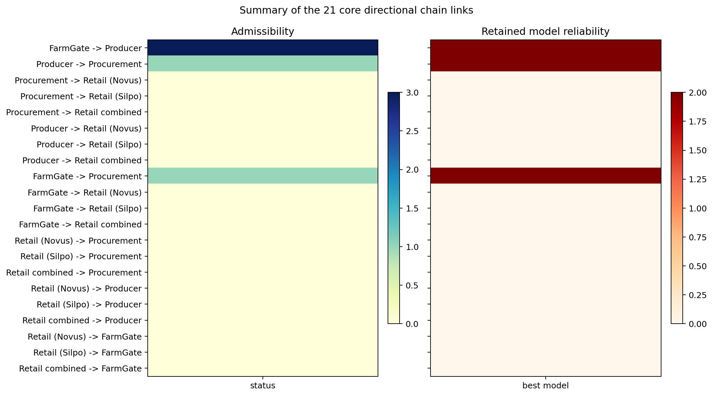

Source: author's calculations based on the admissibility screen and retained weekly model set.

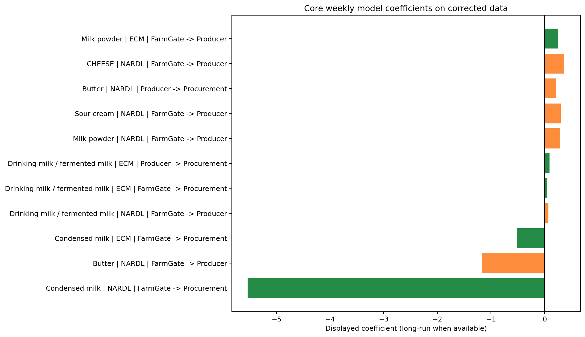

Source: author's calculations based on retained weekly ARDL, ECM, and NARDL models.

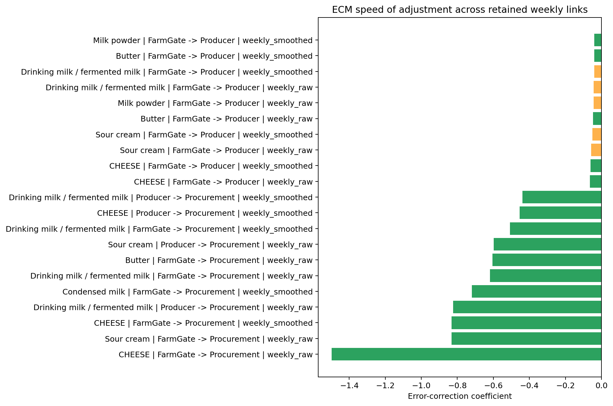

Source: author's calculations based on retained ECM equations.

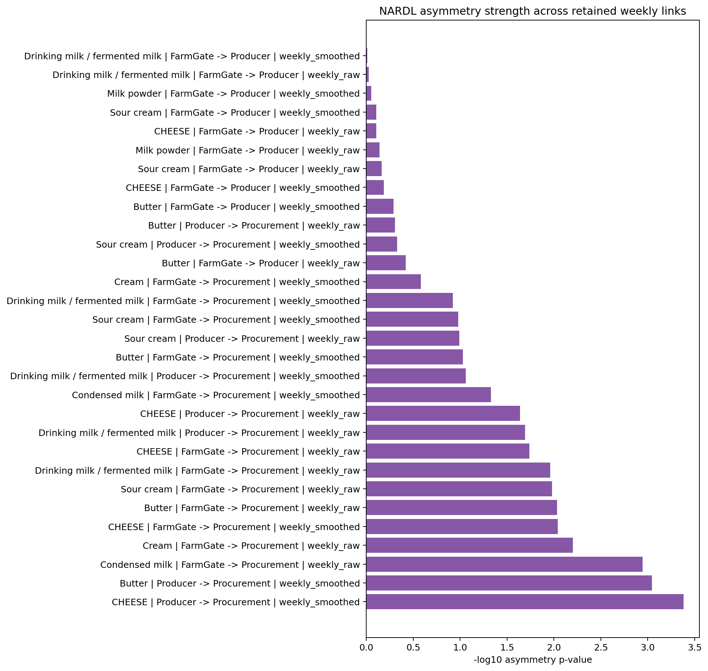

Source: author's calculations based on retained NARDL equations.

### 6.3 Downstream extensions, retail behavior, discounts, and procurement scale

Once the analysis reaches the downstream end of the chain, weekly equilibrium evidence becomes less informative than daily mechanism evidence. This is not a weakness of the design. It is one of the main results of the corrected empirical system. Retail prices are managed through category policy, markdowns, and timing choices. Procurement prices are shaped not only by unit-price movement, but also by contract scale and revisions. These are precisely the kinds of mechanisms that are easier to detect at daily frequency and harder to summarize as one stable long-run slope.

The corrected results retain 28 persistent-margin flags, 132 asymmetric-margin flags, 2 discount-strategy signals, and 5 procurement-scale signals. Jointly, these imply that downstream pricing is not a passive continuation of upstream cost movement. It is a managed layer in which institutional procurement and retail strategy both matter.

Drinking milk / fermented milk shows a discount-persistence coefficient of 0.250 (p = 0.053), while the retail-versus-consumer gap coefficient equals 0.444 (p = 0.000), and the Silpo-versus-Novus gap coefficient equals 0.041 (p = 0.002). CHEESE shows a discount-persistence coefficient of 0.042 (p = 0.643), while the retail-versus-consumer gap coefficient equals -0.251 (p = 0.000), and the Silpo-versus-Novus gap coefficient equals -0.006 (p = 0.504).

For sour cream, the strongest procurement-scale terms are expected value -0.475 (p = 0.003); initial contract sum 1.268 (p = 0.000); current contract sum -0.771 (p = 0.000). For cream, the strongest procurement-scale terms are expected value 0.045 (p = 0.805); initial contract sum -0.239 (p = 0.129); current contract sum 0.184 (p = 0.058). For drinking milk / fermented milk, the strongest procurement-scale terms are expected value -0.408 (p = 0.000); initial contract sum 0.446 (p = 0.001); current contract sum -0.047 (p = 0.485).

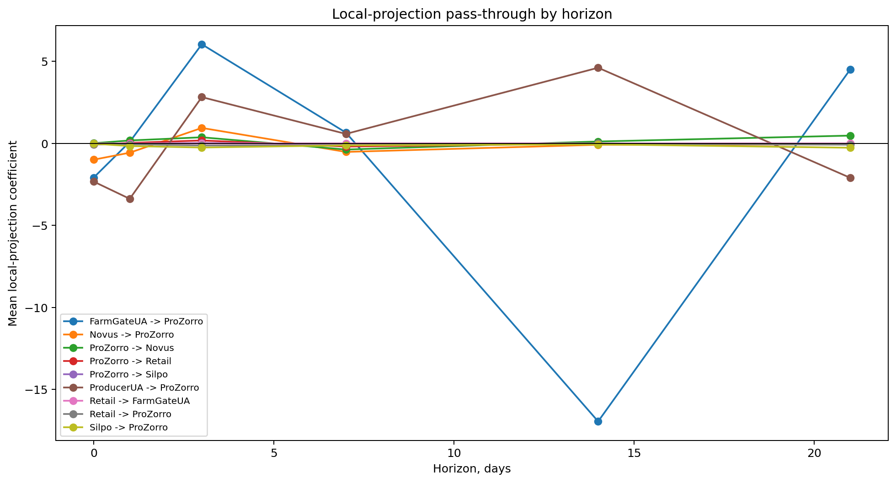

Source: author's calculations based on daily local projections.

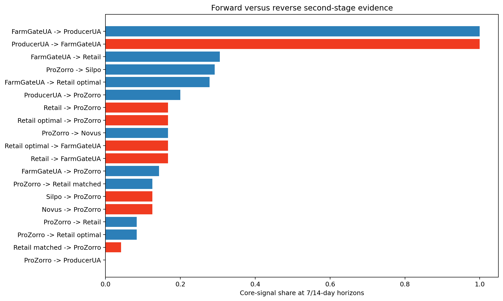

Source: author's calculations based on 7-day and 14-day local-projection summaries.

Source: author's calculations based on product-level spread summaries.

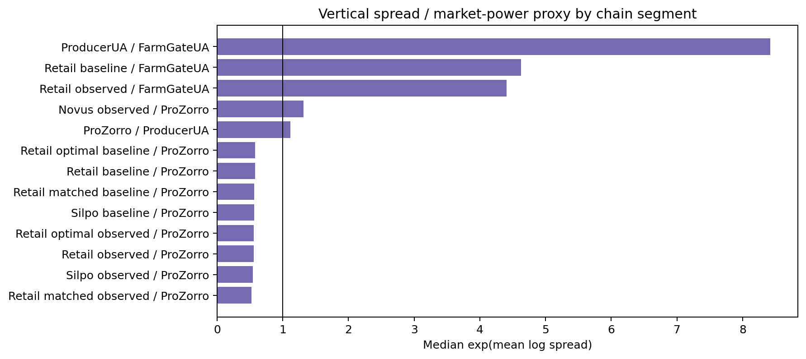

Source: author's calculations based on spread-regression coefficients.

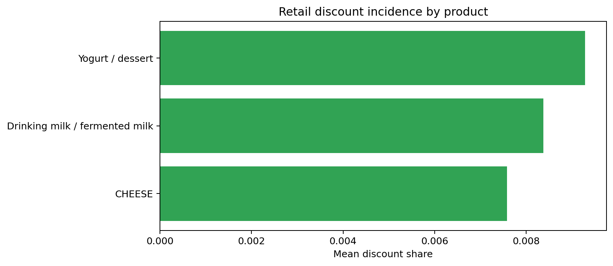

Source: author's calculations based on discount-incidence models.

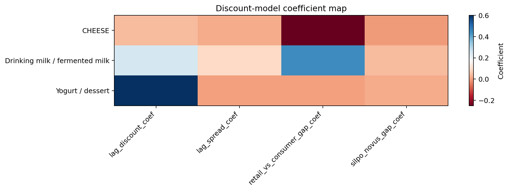

Source: author's calculations based on product-level Silpo discount equations.

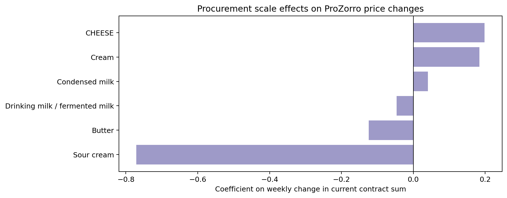

Source: author's calculations based on procurement-scale models with expected value and contract-sum variables.

{{TABLE|Table 6.2. Daily downstream mechanism models|../outputs/chapter_tables/table_6_3_daily_mechanism_models.csv|Source: author's calculations based on local projections, spread models, Silpo discount models, and procurement-scale equations.}}

In substantive terms, the downstream evidence supports a market-power interpretation that is more nuanced than a single markup story. Retail influence appears through timing control, through the use of discounts to keep observed prices temporarily below the non-promotional baseline, and through selective exposure of upstream pressure to the final shelf price. ProZorro, in turn, acts as a buffer: it passes part of upstream movement downstream, but it also absorbs shocks through institutional timing and scale effects before those shocks reach retail.

### 6.4 VECM system evidence, aggregate dairy indices, and the limits of full-chain modelling

The aggregate-index block is introduced as a robustness system, not as a substitute for the product-level results. Because direct quantity weights are unavailable, the aggregate dairy indices are built from fixed structural proxy weights. That makes them suitable for checking whether the broad transmission story survives aggregation, but not for replacing the product-level evidence that remains central to the thesis.

The aggregate-index results support the same general conclusion as the product-level models. Producer-to-procurement remains the cleanest structural step, while the downstream end remains more filtered. At the same time, the system block also makes clear why a fully unified chain model should be treated cautiously. Product-level VECM feasibility remains limited once the corrected overlap and the honest downstream construction are imposed. The system perspective is therefore useful, but it does not overturn the staged interpretation of the chain.

ECM on weekly_raw data reports coefficient 0.883 with error-correction term -1.315 and cointegration p-value 0.000. ECM on weekly_raw data reports coefficient 1.156 with error-correction term -0.213 and cointegration p-value 0.005. The widened system block improves feasibility: aggregate_chain_extended is feasible with 39 weekly observations and rank 2; aggregate_midstream_extended is feasible with 39 weekly observations and rank 1.

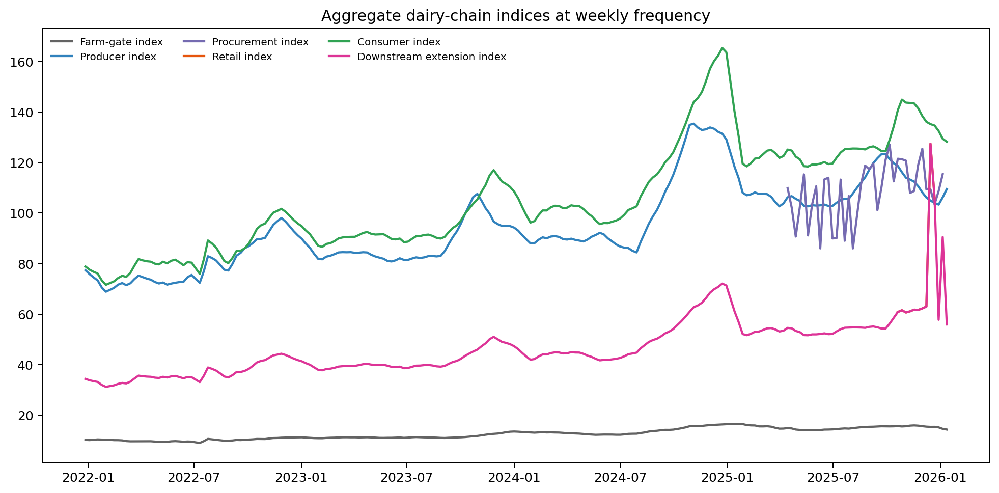

Source: author's calculations based on fixed-weight weekly dairy indices.

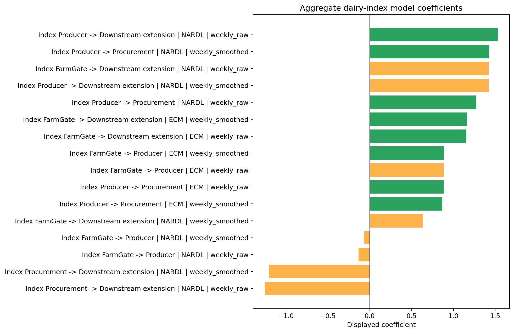

Source: author's calculations based on aggregate-index ECM and NARDL models.

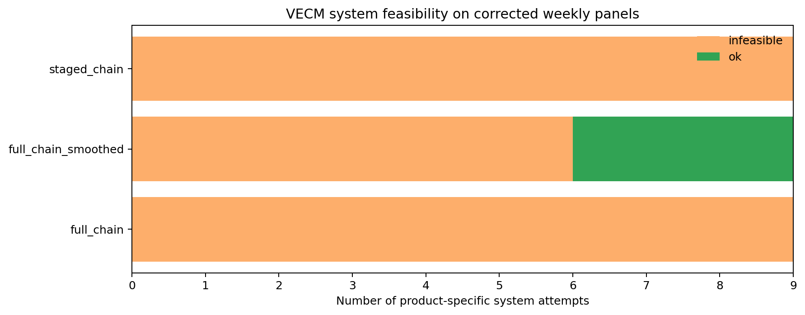

Source: author's calculations based on product-level and aggregate-index VECM feasibility checks.

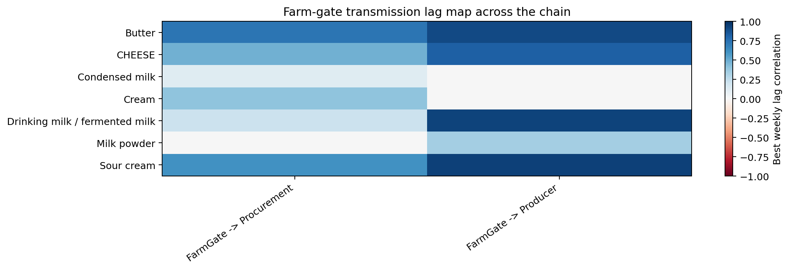

Source: author's calculations based on farm-gate-specific weekly lag-correlation profiles.

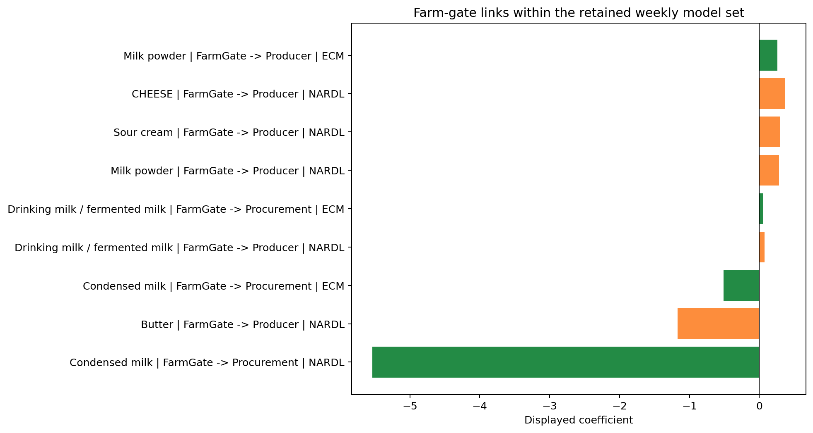

Source: author's calculations based on retained farm-gate-to-downstream weekly equations.

{{TABLE|Table 6.3. Aggregate-index and VECM system results|../outputs/chapter_tables/table_6_4_system_models.csv|Source: author's calculations based on aggregate-index chain models and VECM feasibility outputs.}}

### 6.5 Interpretation of the key results, limitations and ways for improvement

Taken together, the corrected empirical system leads to a coherent interpretation of the Ukrainian dairy market. First, vertical price transmission exists, but the strongest evidence is not equally distributed across the chain. It is strongest before the consumer-facing stage, particularly in the producer-to-procurement segment. Second, procurement is not a neutral corridor. It is a filtering institution whose price and scale dynamics shape what later reaches the shelf. Third, retail market power is visible less as one universal markup coefficient and more as a set of strategic adjustment tools: timing, markdown policy, category management, and selective asymmetry.

This interpretation is consistent with the broader logic of Chapters 1 to 4. The thesis asks how the Ukrainian food consumer market, and especially the dairy market, converts upstream pressure into household-visible prices. The empirical answer is now more precise. Farm-gate remains the raw-milk anchor. Producer prices transmit upstream pressure into the processed-product stage. Procurement converts this pressure into institutional transaction prices, sometimes buffering and sometimes amplifying it through scale and contract conditions. Retail then determines how much of that pressure becomes visible to the consumer and how much is temporarily managed away through pricing strategy.

The limitations also remain important. Strict weekly overlap is still scarce. Product-level VECM feasibility is low. Farm-gate is necessarily a raw-milk benchmark rather than a literal processed-product series. Retail data remain retailer-specific, and the strongest discount evidence is concentrated in Silpo because its markdown logic is observed directly. None of these limitations invalidate the findings, but they set the boundary of what can be claimed with confidence.

The most productive extensions are therefore clear. Better quantity weights would strengthen the aggregate-index block. Longer downstream overlap would improve full-chain system estimation. Richer regional retail coverage could make the market-power interpretation more spatially explicit. Yet even without those extensions, the corrected empirical system already improves the thesis materially because it makes the data logic, the admissibility logic, and the hierarchy of evidence explicit.

For the main thesis argument, the decisive point is that the empirical pattern now fits the institutional structure described in the earlier chapters. Raw-milk pressure is visible, but it does not pass to the shelf mechanically. Processor prices remain the first strong carrier of the shock. Procurement both relays and filters. Retail then decides how much of the pressure becomes immediately visible to consumers and how much is delayed, softened, or redistributed across products through markdowns and category policy.

{{TABLE|Table 6.4. Integrated interpretation, limitations, and research implications|../outputs/chapter_tables/table_6_5_integrated_synthesis.csv|Source: author's synthesis based on the final empirical results.}}

### 6.0 Conclusion

The final result of the empirical rebuild is not a claim that every segment of the dairy chain behaves in the same way. It is a more disciplined statement about where transmission is structurally strongest, where it weakens, and where it becomes strategically managed. On the corrected data, the most defensible long-run transmission still appears before the retail stage, especially between producers and procurement. That is the part of the chain where price meaning is closest, overlap is cleaner, and weekly equilibrium-style estimation remains most credible.

At the same time, the absence of equally strong downstream weekly evidence should not be read as evidence of no downstream transmission. The daily mechanism models show why. Once price pressure reaches procurement and retail, adjustment becomes more tactical. Procurement does not simply forward processor prices. It filters them through contract timing, expected value, and the current and initial contract sums. Retail does not simply add a constant markup. It decides how quickly pressure becomes visible to the consumer, whether it is softened through markdowns, and whether different categories are adjusted in the same way or selectively.

This is precisely why the corrected Silpo discount interpretation matters. Observed shelf price is the post-discount price that the consumer actually sees, whereas discount incidence and discount depth form a separate behavioural layer. The final evidence therefore supports a market-power reading in which downstream influence is visible not only through price levels, but also through the timing and form of adjustment. In the strongest cases, retailers appear to smooth, delay, or selectively expose pass-through rather than simply mirror upstream movement.

The aggregate dairy-index block reinforces rather than overturns this conclusion. It shows that the broad transmission narrative survives aggregation, but it also confirms the limits of a single full-chain system estimate. Product-level VECM remains infeasible on the corrected overlap, and that infeasibility is itself informative. It indicates that the Ukrainian dairy chain is integrated enough to show staged transmission, but not clean enough to justify a single unified equilibrium claim across all products and all downstream stages.

For the broader thesis argument, this matters economically. The Ukrainian food consumer market, and especially its dairy segment, does not pass shocks from the farm to the shelf mechanically. Raw-milk pressure is visible at the farm-gate benchmark. Producer prices are the first clear carrier of the shock into processed-product markets. Procurement then acts as both relay and institutional filter. Retail finally governs how much of this pressure becomes household-visible and how much is temporarily absorbed through discounts, category management, and relative-price strategy. The conclusion is therefore stronger than a simple pass-through finding: the chain is vertically connected, but the transmission mechanism is staged, selective, and shaped by downstream market structure.

The remaining limitations are also substantive rather than cosmetic. Strict weekly overlap remains scarce, especially late in the chain. Regional procurement evidence is richer than regional evidence elsewhere, which means spatial heterogeneity can be discussed more confidently for ProZorro than for the corrected governmental averages. Retail evidence remains richer for Silpo than for Novus because explicit markdown states are observed directly only in Silpo. These limits do not invalidate the final results, but they define the boundary of what can be claimed without overstatement.

The most valuable next step is therefore not to abandon the current design, but to deepen it. Longer downstream overlap, richer quantity or expenditure weights, broader retailer coverage, and more stable regional downstream series would strengthen the full-chain system block and make the market-power interpretation even sharper. Even without those additions, however, the corrected final empirical system now supports a coherent and academically defensible conclusion: price shocks in Ukraine’s dairy market do travel vertically, but their speed, symmetry, and consumer visibility depend on where in the chain the adjustment occurs and on which institution controls that stage of price formation.
