# Chapter 5. Second-stage data and retail harmonisation

This chapter documents the second-stage data architecture used to complement the corrected master-thesis draft. The logic is intentionally close to the main thesis: each source is still treated as an institutional pricing layer, but the downstream retail block is rebuilt more deeply at item level so that Novus and Silpo contribute directly to the stage-4 model rather than only through broad category pooling.

The practical goal of the redesign is not to overturn the master-thesis structure. It is to improve it where the original bottleneck was strongest: retailer product naming, brand reconciliation, literal dairy-product typing, and explicit discount-aware construction of the effective retail price.

## 5.1 Data sources and analytical layers
The second-stage chain still follows FarmGateUA -> ProducerUA -> ProZorro -> Retail. FarmGateUA remains the raw-milk benchmark, ProducerUA remains the processor-level domestic price layer, ProZorro remains the institutional procurement layer, and the retail block is rebuilt from harmonised Novus and Silpo product records. ConsumerUA is added as a downstream robustness environment, not as a replacement for the retailer-facing stage.

The cleaned second-stage panel covers 9 thesis product groups. The retail input after dairy-only reconciliation contains 78556 product-day observations, 362 normalised brand identifiers, and 13 literal dairy-product types. This is materially deeper downstream preparation than the summary-level retail block in the earlier second-stage run.

Figure 5.1. Second-stage panel coverage by product and source.
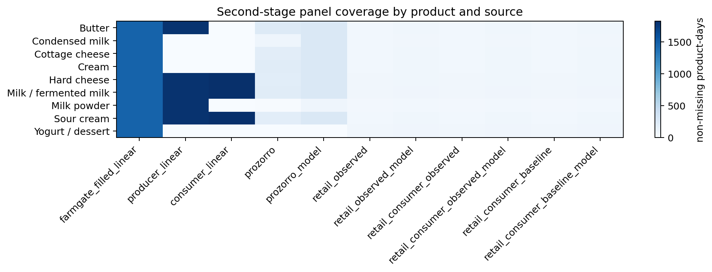
Source: author's calculations based on the second-stage panel coverage table.

## 5.1.1 Retail reconstruction from Novus and Silpo
Retail preparation now begins at the item level. Each row keeps the effective observed shelf price, meaning the discount is already embedded in the price actually faced by the buyer. At the same time, the discount amount, discount state, discount type, and markdown depth are retained as separate variables so that retail adjustment can be studied both through the price itself and through the promotional mechanism behind it.

Literal dairy typing is also made explicit. Instead of trusting the raw shop category alone, product titles, product names, brands, and auxiliary entity labels are cleaned jointly and mapped into literal dairy types such as milk, kefir, yogurt, hard cheese, cottage cheese, sour cream, cream, butter, condensed milk, and milk powder. Plant-based analogues and other non-comparable items are screened out before aggregation, which keeps the downstream series closer to the real dairy chain addressed in the thesis.

The reconciled literal mix is selective rather than generic: Yogurt / dessert -> Yogurt (705 item keys); Hard cheese -> Hard / semi-hard cheese (592 item keys); Yogurt / dessert -> Dairy dessert / glazed snack (318 item keys); Milk / fermented milk -> Milk (292 item keys); Butter -> Butter (163 item keys); Cream -> Cream (135 item keys).

Figure 5.2. Retail literal-product mix after dairy-only reconciliation.
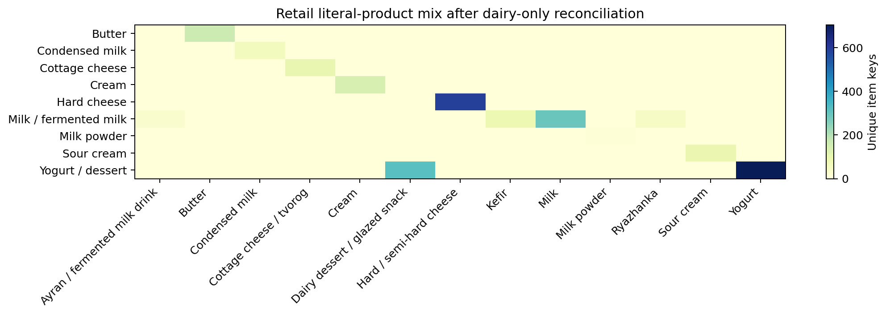
Source: author's calculations based on the harmonised retail literal summary.

## 5.1.2 Cross-shop name reconciliation and brand harmonisation
The core reconciliation object is the harmonised item key. It combines the thesis product group, the cleaned brand, and a canonicalised item name stripped of redundant pack and percentage tokens. This step is necessary because Novus and Silpo often refer to the same item with slightly different wording, word order, or packaging notation.

The resulting audit identifies 200 matched cross-shop item keys, 1229 Silpo-only keys, and 947 Novus-only keys. Among the matched keys, 106 cases also align one-for-one on the stricter fat-and-pack diagnostic key. This is exactly the kind of retailer-name adaptation that was missing from the broad category view.

Figure 5.3. Cross-shop retail item harmonisation status.
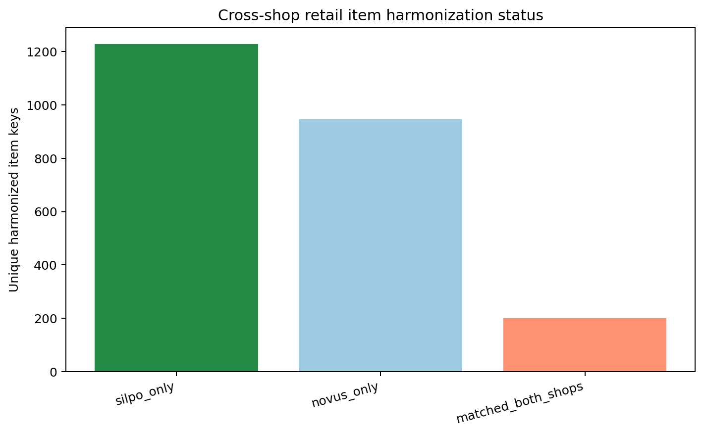
Source: author's calculations based on the retail match audit.

Brand support remains economically meaningful after reconciliation: Butter in Novus: новгород сіверський (1 item keys, 3 days); Butter in Silpo: лавка традицій (23 item keys, 48 days); Condensed milk in Novus: пмкк (5 item keys, 4 days); Condensed milk in Silpo: первомайський мкк (4 item keys, 48 days); Cottage cheese in Novus: president (3 item keys, 5 days); Cottage cheese in Silpo: лавка традицій (9 item keys, 48 days).

Figure 5.4. Dominant retailer-brand support by dairy product.
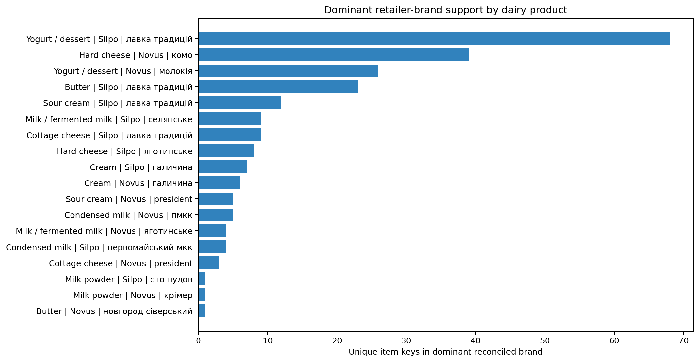
Source: author's calculations based on the reconciled retail brand-support table.

## 5.2 Downstream levels tested for the four-stage model
The retail endpoint is not forced into one representation. Instead, the second-stage pipeline constructs and keeps several candidate downstream levels: merged full-list retail, matched cross-shop retail, Silpo-only retail, Novus-only retail, and a retail-plus-ConsumerUA endpoint. Each level is useful for a different reason. The merged series maximises assortment support, the matched series maximises cross-shop comparability, Silpo and Novus preserve retailer-specific pricing behaviour, and the ConsumerUA-linked variant extends the downstream environment when retailer support is thin.

Candidate levels are compared product by product using a composite score that combines coverage, procurement alignment, consumer alignment, item-support depth, and discount variation. This complements the master-thesis draft because it keeps the same four-stage chain but tests whether stage 4 is better represented by a broader retail pool, a stricter matched subset, a retailer-specific panel, or a consumer-linked endpoint.

The selected level by product is as follows: Butter: Retail merged full list (score 0.50); Condensed milk: Retail merged full list (score 0.48); Cottage cheese: Retail merged full list (score 0.49); Cream: Retail merged full list (score 0.60); Hard cheese: Retail plus ConsumerUA (score 0.65); Milk / fermented milk: Retail merged full list (score 0.56); Milk powder: Retail matched cross-shop (score 0.31); Sour cream: Retail merged full list (score 0.64); Yogurt / dessert: Retail merged full list (score 0.48).

Figure 5.5. Candidate downstream retail scores by product.
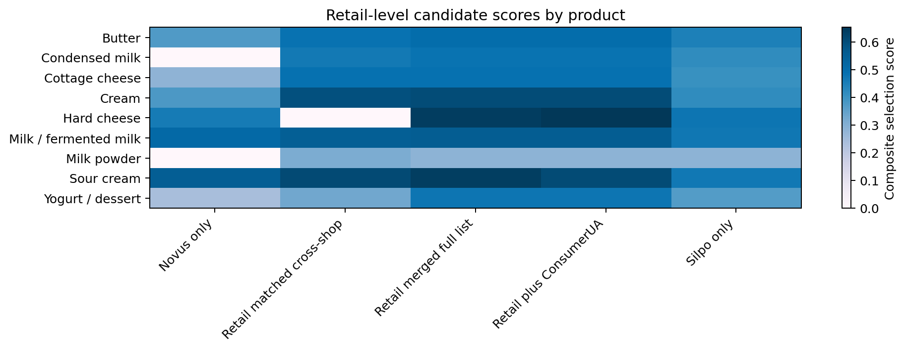
Source: author's calculations based on the retail-level selection table.

Figure 5.6. Chosen optimal retail level by product.
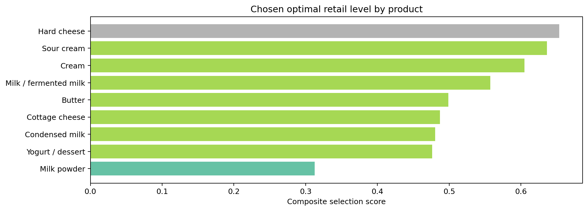
Source: author's calculations based on the selected retail-level hierarchy.

## 5.3 Discount-aware downstream environment
Discount variables remain central because the user requested that the final effective price should include the markdown while the markdown mechanism itself remains modelled separately. This design matches the master-thesis interpretation more closely than a raw regular-price series would. It treats retail adjustment as a combination of baseline repricing and promotional smoothing, not as one undifferentiated observed price path.

Figure 5.7. Retail discount environment by product and retailer.
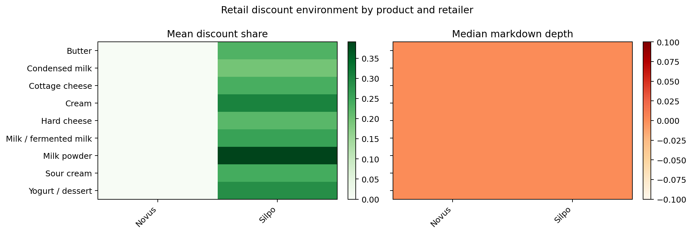
Source: author's calculations based on retailer-product discount states in the harmonised retail panel.

## 5.4 What remains after second-stage preparation
After reconciliation, the downstream data are no longer a loose category average. They are a hierarchy of comparable retail series supported by explicit item keys, literal product types, brand structure, and discount metadata. That makes the second-stage outputs much easier to defend as a robustness complement to the corrected thesis draft: the master thesis keeps the broader structural story, while this second-stage data chapter shows that the downstream block has been rebuilt in a more disciplined way.

The most important dataset files produced by this chapter are `data/retail_items_full_harmonized.csv`, `data/retail_brand_daily.csv`, `data/retail_literal_summary.csv`, `data/retail_level_selection.csv`, and `data/retail_optimal_daily.csv`. Together they document exactly how the stage-4 retail block was built before the models were rerun.

# Chapter 6. Second-stage estimation results

The second-stage estimation chapter is designed to complement the corrected master-thesis draft rather than duplicate it. The draft already uses the richer RW4 ARDL/ECM/NARDL/VECM stack as the main structural evidence. This chapter therefore asks a narrower but important question: if the retail stage is rebuilt more carefully from Novus and Silpo item-level data, do the main economic conclusions survive under a different modelling design?

The answer is broadly yes, but the evidence remains selective and product-dependent. That is precisely why the second-stage methods are useful: they stress-test the thesis argument without pretending to replace the draft's main identification logic.

## 6.1 Model families and their role
The first model family uses local projections. It estimates cumulative downstream responses over 0, 1, 3, 7, 14, and 21 days with HAC inference. This complements the main draft because it avoids forcing each link into one equilibrium-correction structure and instead asks where timing evidence is stable across horizons.

The second model family uses vertical spread equations. These are not direct market-power proofs, but they are useful proxies for timing control, asymmetric margin adjustment, and discount-mediated smoothing. The third block keeps a focused discount model in which retail discount incidence is related to lagged discount states and upstream price variation.

In total, the second-stage local-projection block estimates 3570 linear models, of which 728 pass the p<0.10 and overlap screen. The leading 7/14-day thesis-relevant signals are: ProZorro -> Silpo (silpo_baseline, h=7): core share 42.9%, median coefficient -0.025; FarmGateUA -> Retail+Consumer (retail_consumer_observed, h=7): core share 41.7%, median coefficient -3.610; ProducerUA -> ProZorro (procurement_price, h=7): core share 40.0%, median coefficient 1.497; FarmGateUA -> Retail (retail_observed, h=7): core share 38.9%, median coefficient -2.996; Retail -> FarmGateUA (retail_observed, h=14): core share 38.9%, median coefficient 0.000.

Figure 6.1. Local-projection pass-through by horizon.
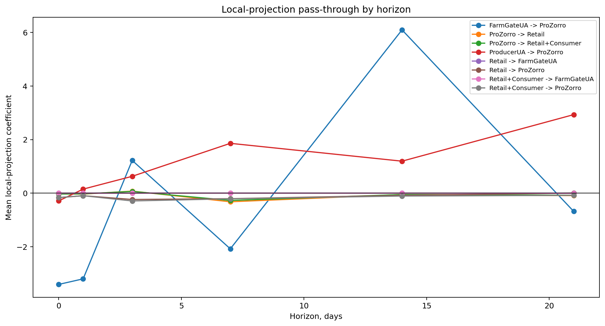
Source: author's calculations based on the second-stage local-projection summary.

Figure 6.2. Forward versus reverse second-stage evidence.
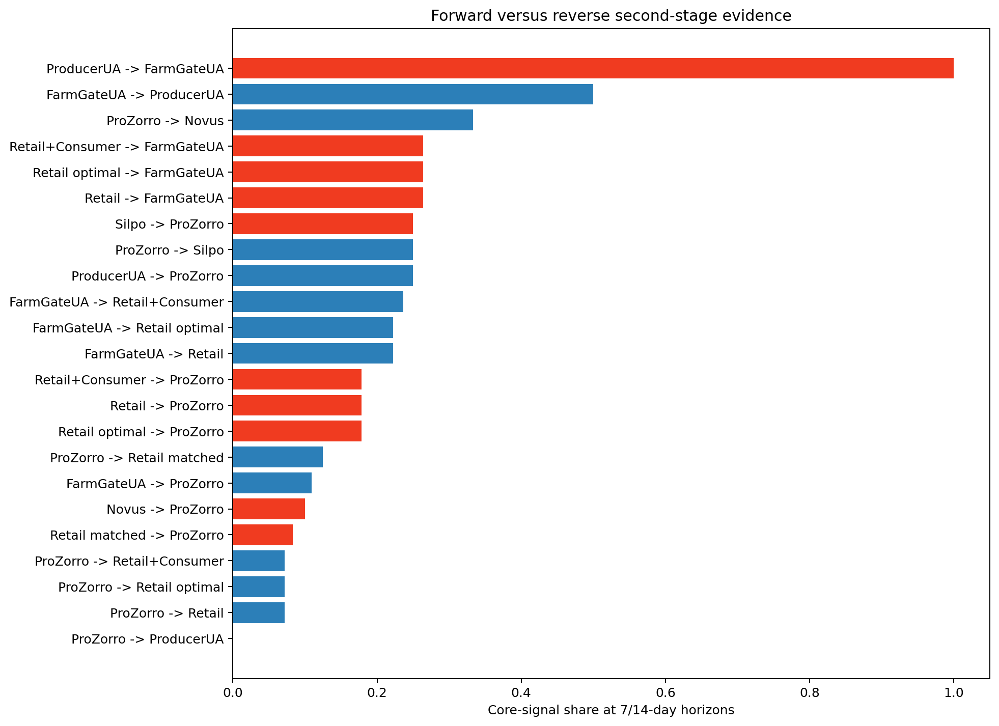
Source: author's calculations based on the second-stage local-projection summary.

## 6.2 Procurement to retail under alternative downstream levels
A key improvement relative to the earlier second-stage run is that procurement-to-retail evidence is not evaluated only on one pooled retail line. The pipeline now tests merged retail, matched retail, retailer-specific series, the ConsumerUA-linked series, and the selected optimal series. This directly addresses the concern that stage-4 measurement can change the interpretation of market power.

The candidate comparison shows the following ranking of downstream LP evidence: ProZorro -> Novus: mean 7/14-day core share 33.3%; ProZorro -> Silpo: mean 7/14-day core share 25.0%; ProZorro -> Retail matched: mean 7/14-day core share 12.5%; ProZorro -> Retail: mean 7/14-day core share 7.1%; ProZorro -> Retail optimal: mean 7/14-day core share 7.1%.

Figure 6.3. Candidate downstream levels in procurement-to-retail local-projection tests.
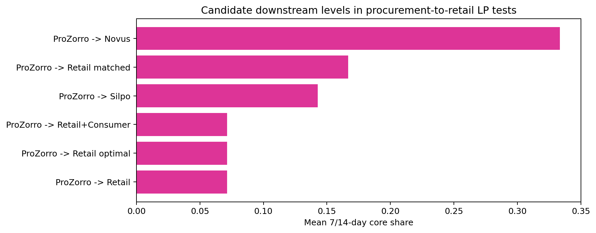
Source: author's calculations based on 7/14-day LP core shares across retail candidates.

This comparison is economically useful because it separates three ideas that are often conflated. First, more coverage is not always better if it comes from a weaker retailer-grounded series. Second, stricter matched-item support is cleaner but shorter. Third, the ConsumerUA-linked endpoint can help with continuity, but it should still be treated as a robustness extension rather than as the literal shelf-price stage. That logic mirrors the corrected master-thesis draft rather than competing with it.

## 6.3 Vertical spreads, market power, and discount effects
The spread block produces 280 usable equations. Persistent-margin flags appear in 24 rows and asymmetric-margin flags appear in 223 rows. This does not prove structural market power on its own, but it is consistent with downstream timing control, selective margin adjustment, and retailer category management.

Figure 6.4. Vertical spread and market-power proxy by chain segment.
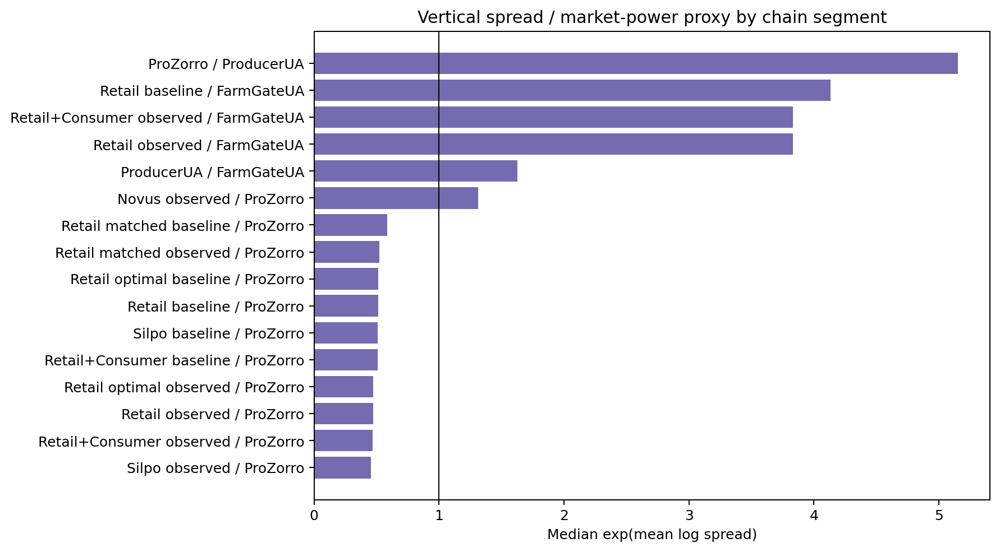
Source: author's calculations based on the vertical spread summary.

The discount block remains more cautious than the main RW4 draft: it yields 4 usable equations and 2 formal discount-strategy signals. That weaker statistical result does not mean discounts are unimportant. Instead, it suggests that in this reduced-form second-stage design the discount mechanism is most visible as part of the retail data-generating process rather than as a stand-alone structural driver.

Figure 6.5. Retail discount incidence by product.
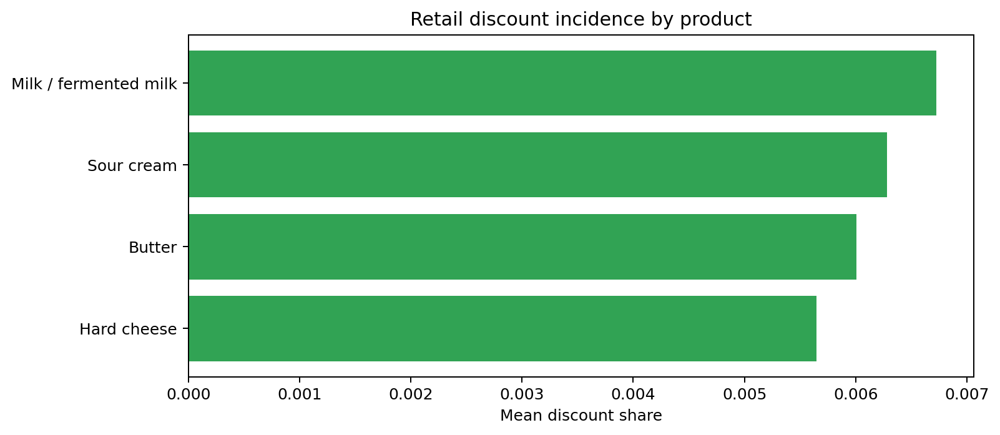
Source: author's calculations based on the second-stage discount model table.

## 6.4 Interpretation relative to the corrected thesis draft
The second-stage results support the same broad market interpretation as the master-thesis draft, but through a different route. Procurement still behaves like an institutional buffer rather than a frictionless conduit. Retail still behaves like a managed adjustment layer. The main economic story still points toward product-specific vertical coordination rather than toward one universal pass-through elasticity.

What changes is the emphasis. The second-stage redesign gives more weight to the downstream data-generating process itself: how item names are reconciled, how brand structure survives aggregation, how discount states are retained inside and outside price, and how the choice of retail endpoint changes the strength of the stage-4 model. That is exactly why this chapter complements the corrected draft: it improves the credibility of the retail stage without forcing the whole thesis to depend on one extra modelling family.

Farm-gate results should remain conservative here as well. The second-stage run still shows that direct FarmGateUA -> ProducerUA evidence can look mechanically strong because both sides are reconstructed and smooth. The more defensible interpretation remains the same as in the corrected draft: FarmGateUA is an upstream benchmark and robustness dimension, not a literal product-level farm-to-shelf elasticity generator.

## 6.5 Conclusion and practical implication
The strongest contribution of the second-stage chapter is methodological. It shows that once the retail block is rebuilt at item level, filtered to literal dairy products, reconciled across Novus and Silpo, and tested across multiple downstream levels, the core thesis still holds. The retail stage does not behave like a passive residual of upstream costs. It behaves like a strategic adjustment layer in which timing, discount use, brand structure, and category management matter for observed price transmission.

This strengthens the corrected master-thesis draft rather than displacing it. The draft can continue to rely on the richer ECM/NARDL evidence as the main structural story, while the second-stage chapter demonstrates that the downstream interpretation survives deeper retail cleaning and a different empirical design.